# คู่มือการ Activate Tableau Next

คู่มือตั้งแต่ขอ SDO Demo Org จนถึงสร้าง Workspace สำหรับใช้งาน Tableau Next

## สารบัญ

- [Step 1: ขอ SDO Data Cloud](#step-1-ขอ-sdo-data-cloud)
- [Step 2: Activate Salesforce Org](#step-2-activate-salesforce-org)
- [Step 3: ตั้งค่า Data Cloud Architect User และเปิด Data Cloud](#step-3-ตั้งค่า-data-cloud-architect-user-และเปิด-data-cloud)
- [Step 4: เปิดใช้งาน Einstein](#step-4-เปิดใช้งาน-einstein)
- [Step 5: เปิดใช้งาน Agentforce](#step-5-เปิดใช้งาน-agentforce)
- [Step 6: เปิดใช้งาน Tableau Next](#step-6-เปิดใช้งาน-tableau-next)
- [Step 7: เปิด Tableau Next Features และสร้าง Workspace](#step-7-เปิด-tableau-next-features-และสร้าง-workspace)
- [เอกสารอ้างอิง](#เอกสารอ้างอิง)

---

## Step 1: ขอ SDO Data Cloud

1. Login เข้า Partner Learning Camp (PLC) ที่ <https://partnerlearningcamp.salesforce.com/s/demo-org>
2. เลือก **Request for a Demo Org** → เลือก Demo Type เป็น **SDO** → กรอก unique username ที่ต้องการ → กด **Submit**
3. รอรับอีเมลยืนยันจาก Salesforce

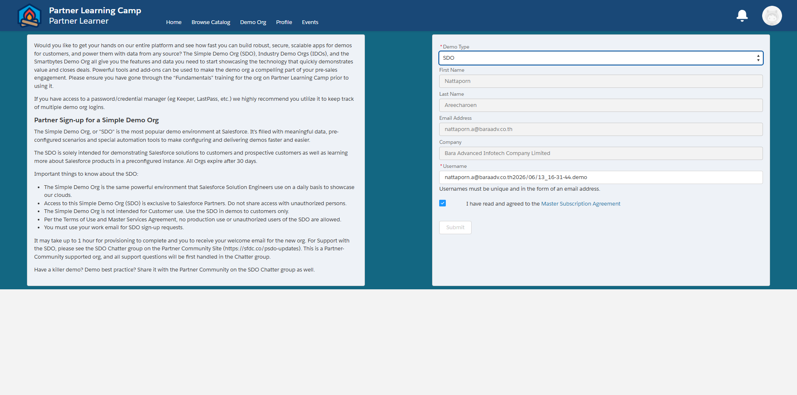

## Step 2: Activate Salesforce Org

ให้ดำเนินการผ่านอีเมลเชิญที่ Salesforce ส่งมา เพื่อตั้งรหัสผ่านและเข้าใช้งาน Org

## Step 3: ตั้งค่า Data Cloud Architect User และเปิด Data Cloud

### 3.1 มอบสิทธิ์ Permission Set ให้ User

1. มุมขวาบน คลิกไอคอนเฟือง ⚙ → **Setup**

   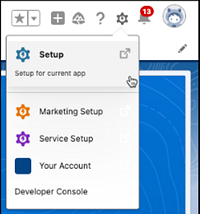

2. ที่ Quick Find พิมพ์ **Users** → เลือก **Users** → คลิกชื่อ user ที่ต้องการมอบสิทธิ์

   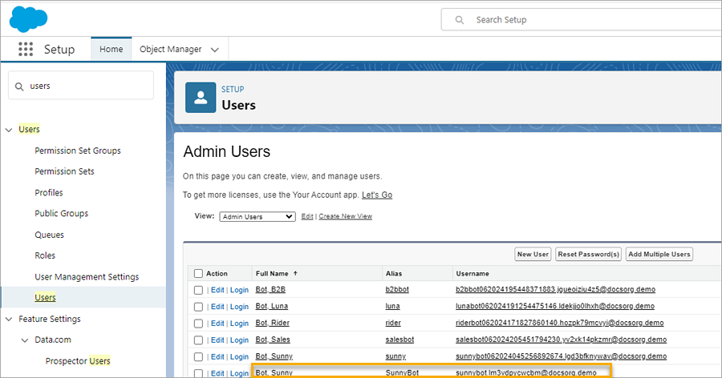

3. ที่ส่วน **Permission Set Assignments** → กด **Edit Assignments**

   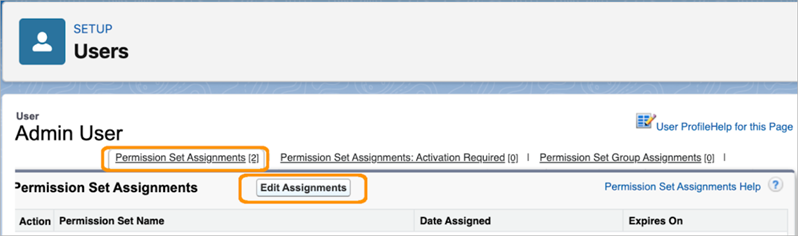

4. เลือก **Data Cloud Architect** และ **Tableau Next Admin** จาก Available Permission Sets → กดลูกศร **Add** → **Save**

   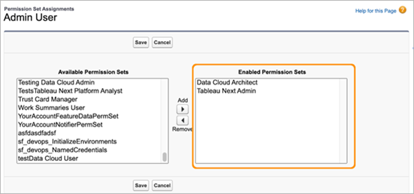

### 3.2 เปิดใช้งาน Data Cloud

1. กลับไปที่ Setup อีกครั้ง ควรเห็นเมนู **Data Cloud Setup** ที่แถบซ้ายมือ

   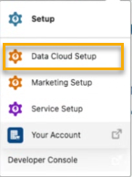

2. ที่มุมล่างซ้าย เลือก Turn on Data Cloud → กด **Get Started** ระบบจะ provision Data Cloud ให้อัตโนมัติ

   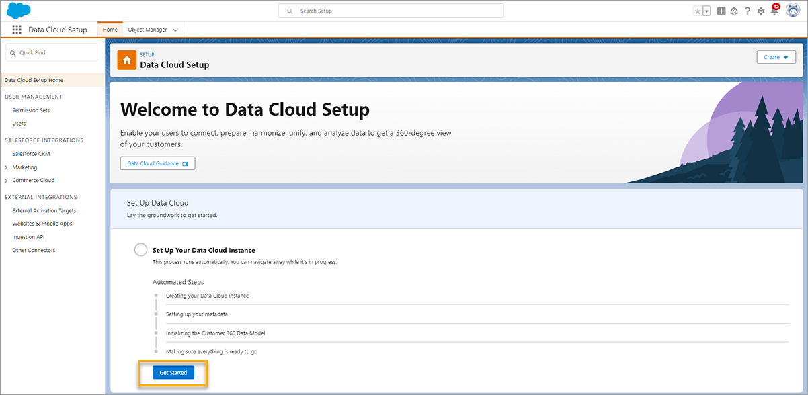

## Step 4: เปิดใช้งาน Einstein

### 4.1 Turn on Einstein

1. ไปที่ Setup → Quick Find พิมพ์ **Einstein Setup** → เลือก **Einstein Setup**

   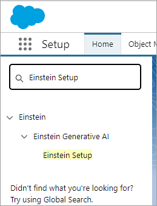

2. เปิด toggle **Turn on Einstein**

   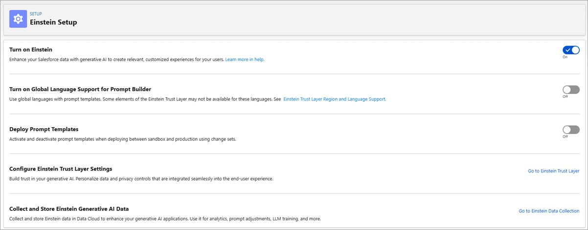

### 4.2 ตั้งค่า Einstein Trust Layer (Data Masking)

1. จากหน้า Einstein Setup กด **Go to Einstein Trust Layer**
2. เปิด **Large Language Model Data Masking**

   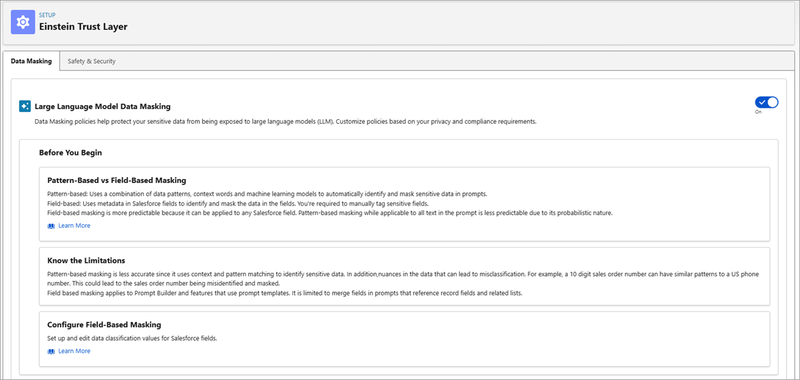

### 4.3 เปิด Einstein Data Collection and Storage

1. ไปที่ Setup → Quick Find พิมพ์ **Einstein Audit** → เลือก **Einstein Audit, Analytics, and Monitoring Setup**
2. เปิด **Audit and Feedback**

   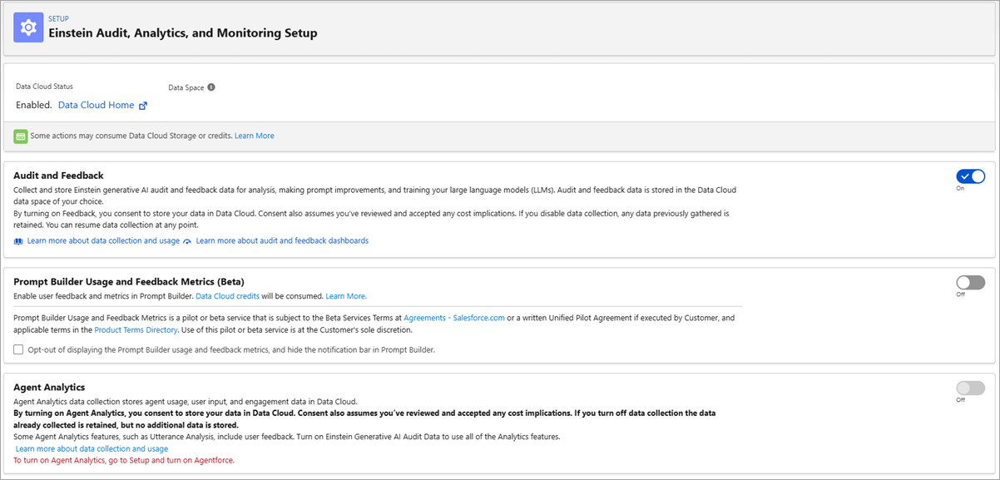

## Step 5: เปิดใช้งาน Agentforce

1. ไปที่ Setup → Quick Find พิมพ์ **Agentforce Agents**
2. เปิด toggle **Agentforce Agents**

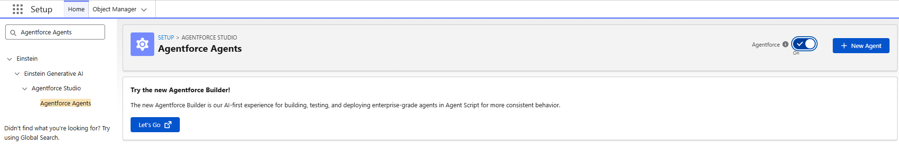

## Step 6: เปิดใช้งาน Tableau Next

1. ไปที่ Setup → Quick Find พิมพ์ **Tableau Next Setup** → เลือก **Tableau Next Setup**
2. เปิด toggle **Enable Tableau Next**
3. ที่ส่วน Setup Steps เปิด toggle **Turn On AI Features**
4. กด **Go to Tableau Next** (มุมขวาบน)

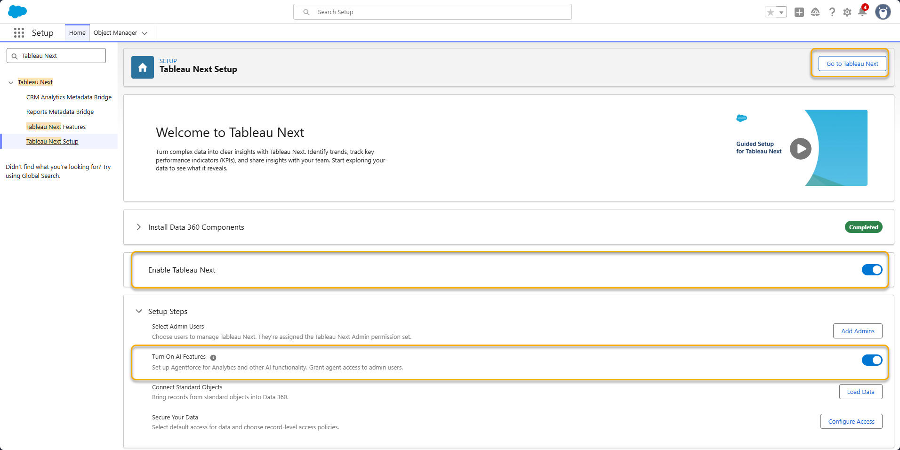

> **หมายเหตุ:** ควรเปิด Agentforce (Step 5) ก่อน เพราะ AI Features ของ Tableau Next ต้องใช้ Agentforce ร่วมกัน

## Step 7: เปิด Tableau Next Features และสร้าง Workspace

### 7.1 เข้าสู่หน้า Administrator

1. ที่หน้า Home เลือก **Administrator**

   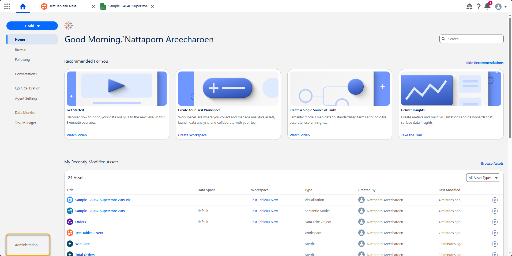

### 7.2 เปิด Features

1. ที่หน้า Administrator เลือก **Settings** → **Tableau Next Features**

   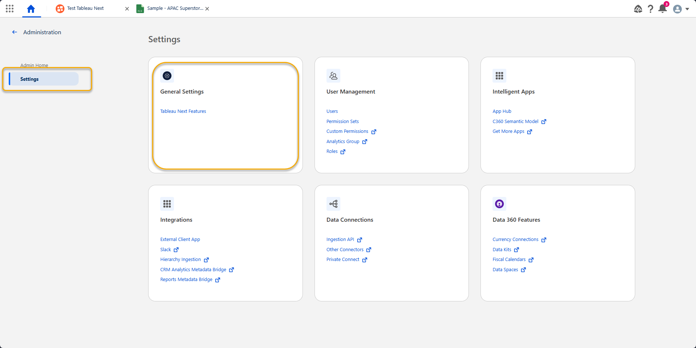

2. เปิดใช้งาน Feature ต่อไปนี้
   - Tableau Agent
   - Data Analysis
   - Semantic Model Curation

   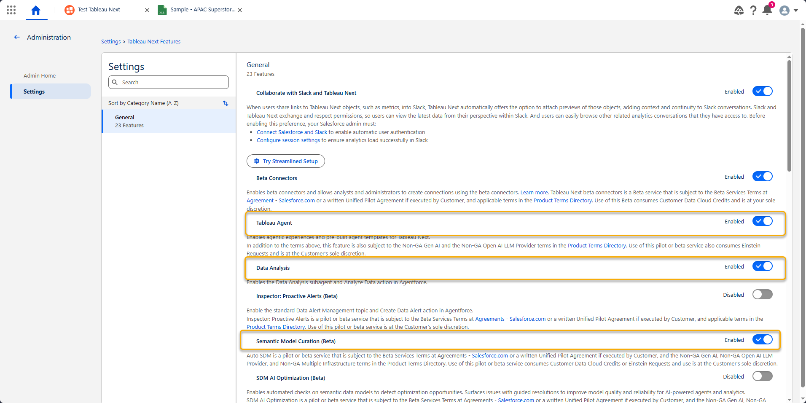

### 7.3 สร้าง Workspace

1. กลับมาที่หน้า **Administration** → กด **Create Workspace**
2. เมื่อสร้างสำเร็จ จะสามารถเริ่มใช้งาน Tableau Next ได้

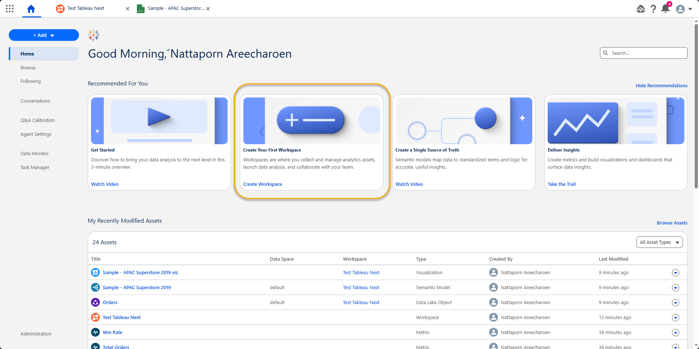

## เอกสารอ้างอิง

- <https://help.salesforce.com/s/articleView?id=analytics.tua_admin_enable_agentforce_templates.htm&type=5>
